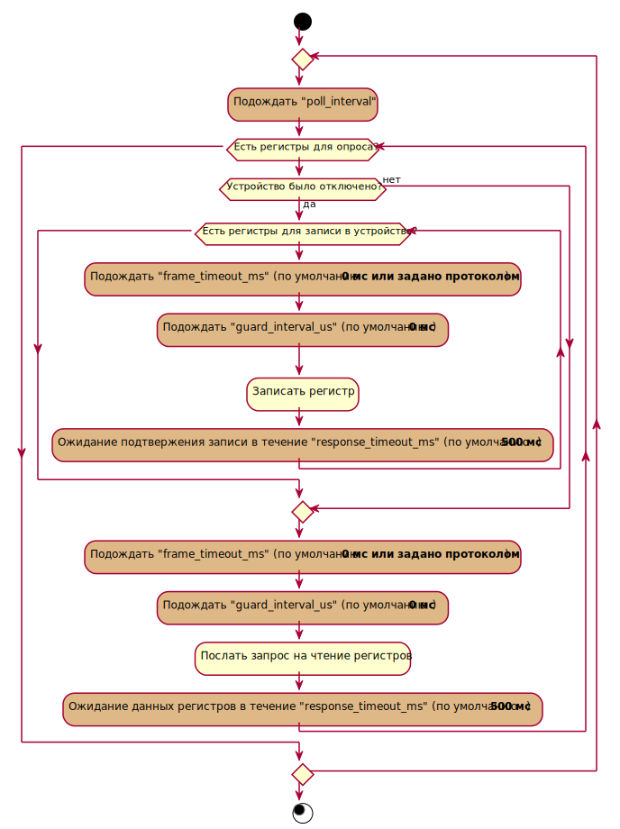

# wb-mqtt-serial

Serial device <==> MQTT bridge which follows [Wiren Board MQTT Conventions](https://github.com/contactless/homeui/blob/master/conventions.md).
It's designed to be used on [Wiren Board](http://contactless.ru/en/) family of programmable automation controllers (PACs), although there is nothing that prevents it from running on a arbitrary Linux machine.

Драйвер master-slave протоколов для устройств, работающих через
последовательный порт. В драйвере wb-mqtt-serial реализована
поддержка некоторых устройств, работающих по протоколам Modbus,
[Uniel](http://smart.uniel.ru),
[ИВТМ](http://www.eksis.ru/catalog/measures-of-relative-humidity-and-temperature/),
[Меркурий 230](http://www.incotexcom.ru/m230art.htm),
[Милур](http://www.milur.ru/),
[Энергомера ГОСТ МЭК 61107](http://www.energomera.ru/),
[НЕВА МТ 32х ГОСТ МЭК 61107](https://www.meters.taipit.ru/).

Запускается командой `systemctl start wb-mqtt-serial` или `service wb-mqtt-serial start`
По умолчанию запуск драйвера происходит при загрузке системы при наличии конфигурационного файла `/etc/wb-mqtt-serial.conf`. При первоначальной установке пакета создаётся конфигурационный файл, в котором не описано ни одного подключенного устройства. В этом случае запуск драйвера завершается с ошибкой. Добавьте устройства в `/etc/wb-mqtt-serial.conf`, либо воспользуйтесь онлайн-редактором настроек для начала работы.

Возможен запуск демона вручную, что может быть полезно
для работы в отладочном режиме:

```
# service wb-mqtt-serial stop
# wb-mqtt-serial -c /etc/wb-mqtt-serial.conf -d
```

Конфигурационный файл построен по трёхуровневой схеме:
порты (ports) -> устройства (devices) -> каналы (channels).
Конфигурация устройства device может быть задана двумя способами:
вручную прописать все параметры или задать только пять параметров:
```jsonc
{
    // По DeviceType драйвер будет искать в папках с шаблонами описаний устройств
    "device_type" : "DeviceType",

    // отображаемое имя устройства. Публикуется как
    // .../meta/name в MQTT
    // По умолчанию name берется из шаблона и добавляется slave_id, т.е.
    // "name" + " " + "slave_id"
    "name" : "somename",

    // уникальный идентификатор устройства в MQTT.
    // каждое элемент в devices должен иметь уникальный id
    // topic'и, относящиеся в MQTT к данному устройству,
    // имеют общий префикс /devices/<идентификатор топика>/...
    // также по умолчанию берется из шаблона с добавлением slave_id:
    // "deviceID" + "_" + slave_id
    "id" : "deviceID",

    // идентификатор slave
    "slave_id" : slaveID,

    // включить/выключить устройство. В случае задания
    // "enabled": false опрос устройства и запись значений
    // его каналов не происходит. По умолчанию - true.
    "enabled" : true,

    // если используется шаблон устройства, определения
    // каналов совмещаются. Если имя (name) в определении
    // канала устройства совпадает с именем канала в шаблоне,
    // свойства каналов из шаблона и определения устройства
    // совмещаются, при этом значения свойств из определения
    // устройства (в файле конфигурации) имеют преимущество.
    // Это можно использовать, например, для задания индивидуальных
    // интервалов опроса каналов. Если канал с таким же
    // именем, как канал в определении устройства, отсутствует
    // в шаблоне, создаётся новый канал.
    "channels": [
        {
            // имя канала. topic'и, соответствующие каналу,
            "name" : "Temp 1",
            "poll_interval": 10000
        }
    ]
}
```
Шаблоны описаний устройств при установке пакета расположены в папке `/usr/share/wb-mqtt-serial/templates`. Если необходимо создать шаблон нового устройства, надо сохранить его в папке `/etc/wb-mqtt-serial.conf.d/templates`, она предназначен для пользовательских шаблонов.
Структура папок *templates* такова, что в каждом файле приведены параметры для одного типа устройств.
Также можно совместить первый способ со вторым, к вышеприведенным 5 параметрам дописать конфигурацию для каналов, которые не прописаны в соответствующем файле в папке *templates*.
См. также: [пример конфигурационного файла с использованием шаблонов](config.sample.json).

Ниже приведён пример конфигурационного файла /etc/wb-mqtt-serial.conf

```jsonc
{
    // опция debug включает или выключает отладочную печать.
    // Опция -d командной строки wb-mqtt-serial также
    // включает отладочную печать и имеет приоритет над
    // данной опцией.
    "debug": false,

    // Задаёт интервал в секундах, в течение которого неизменяющиеся значения не будут публиковаться в MQTT.
    // По истечении интервала полученное значение будет опубликовано, даже если оно не изменилось.
    // Если установлен 0, каждое полученное от устройств значение будет опубликовано в MQTT.
    // Если установлено отрицательное значение, то значения будут публиковаться только при изменении. Это поведение по умолчанию.
    "max_unchanged_interval": -1,

    // список портов
    "ports": [
        {
            // тип порта:
            // - "serial": последовательные порты RS-485 или RS-232. Это значение выбирается по умолчанию.
            // - "tcp": serial over TCP/IP. Пакеты, формируемые для работы с последовательными портами, передаются без изменений через TCP/IP.
            // - "modbus tcp": передача по MODBUS TCP. В секции устройств с таким типом порта могут использоваться только те, что поддерживают MODBUS.
            "port_type": "serial",

            // устройство, соответствующее порту RS-485 (если выбран тип порта serial)
            "path" : "/dev/ttyNSC0",

            // IP адрес или имя хоста (если выбран тип порта TCP или MODBUS TCP)
            "address": "127.0.0.1",

            // TCP порт (если выбран тип порта TCP или MODBUS TCP)
            "port": 3000,

            // скорость порта
            "baud_rate": 9600,

            // паритет - N, O или E (по умолчанию - N)
            "parity": "N",

            // количество бит данных (по умолчанию - 8)
            "data_bits": 8,

            // количество стоп-бит
            "stop_bits": 2,

            // Минимальный интервал опроса каждого регистра
            // по-умолчанию для устройств, подключенных к порту,
            // в миллисекундах
            "poll_interval": 10,

            // Максимальное время ответа устройств, подключенных к этому порту, в миллисекундах
            // Если не установлено, то принимается равным 500 мс
            // Этот параметр задан в шаблонах описания устройств, переопределять его можно только в случае некорректной работы с устройствами
            "response_timeout_ms": 100,

            // Дополнительная задержка перед каждой отправкой данных в порт в микросекундах
            "guard_interval_us": 1000,

            // Таймаут соединения (только для TCP или MODBUS TCP порта).
            // Если в течение указанного времени ни по одному устройству на порту не поступило данных (а также истек "connection_max_fail_cycles"),
            // TCP соединение будет разорвано и произойдет попытка переподключения
            "connection_timeout_ms": 5000,

            // Количество неудачных циклов опроса (только для TCP или MODBUS TCP порта)
            // Если в течение указанного количества циклов опроса ни по одному устройству на порту не поступило данных (а также истек "connection_timeout_ms"),
            // TCP соединение будет разорвано и произойдет попытка переподключения
            "connection_max_fail_cycles": 2,

            // включить/выключить порт. В случае задания
            // "enabled": false опрос порта и запись значений
            // каналов в устройства на данном порту не происходит.
            // По умолчанию - true.
            "enabled": true,

            // список устройств на данном порту
            "devices" : [
                {
                    // отображаемое имя устройства. Публикуется как
                    // .../meta/name в MQTT
                    "name": "MSU34+TLP",

                    // уникальный идентификатор устройства в MQTT.
                    // каждое элемент в devices должен иметь уникальный id
                    // topic'и, относящиеся в MQTT к данному устройству,
                    // имеют общий префикс /devices/<идентификатор топика>/...
                    "id": "msu34tlp",

                    // идентификатор устройства. 
                    // Если указана пустая строка, то используются широковещательные запросы
                    "slave_id": 2,

                    // включить/выключить устройство. В случае задания
                    // "enabled": false опрос устройства и запись значений
                    // его каналов не происходит. По умолчанию - true.
                    "enabled": true,

                    // максимальное количество считываемых "пустых" регистров.
                    // Драйвер в целях оптимизации может считывать регистры
                    // "пачкой". При этом, если какие-либо регистры не
                    // были включены в конфигурацию, но в целях ускорения
                    // опроса (чтобы не разрывать "пачку") их всё-таки
                    // можно считывать, можно указать значение max_hole_size
                    // больше 0. В данный момент поддерживается только
                    // устройствами Modbus.
                    "max_reg_hole": 10,

                    // то же самое, что max_reg_hole, но для однобитовых
                    // регистров (coils и discrete inputs в Modbus). В данный
                    // момент поддерживается только устройствами Modbus.
                    "max_bit_hole": 80,

                    // максимальное количество регистров в одной пакетной операции
                    // чтения. В данный момент поддерживается только устройствами
                    // Modbus.
                    "max_read_registers": 10,

                    // Минимальный интервал опроса регистров данного устройства в миллисекундах
                    "poll_interval": 10,

                    // Максимальное время ответа устройства в миллисекундах.
                    // Если не установлено, то принимается равным 500 мс. 
                    // Если значение этого параметра, установленное для порта, больше указанного здесь, используется значение порта.
                    // Этот параметр задан в шаблонах описания устройств, переопределять его можно только в случае некорректной работы с устройством.
                    "response_timeout_ms": 100,

                    // Минимально необходимая задержка между посылками в миллисекундах.
                    // Используется в некоторых протоколах для определения границ посылок.
                    // Этот параметр задан в шаблонах описания устройств, переопределять его можно только в случае некорректной работы с устройством.
                    // По умолчанию 20 мс
                    "frame_timeout_ms": 100,

                    // Дополнительная задержка перед каждой отправкой данных в порт в микросекундах.
                    // Если не установлено, то используется значение, заданное в соответствующем параметре порта.
                    "guard_interval_us": 0,

                    // (При возникновении ошибки) Интервал после последнего успешного обмена данными с устройством,
                    // по истечении которого (а также "device_max_fail_cycles") устройство будет помечено отключенным и будет опрашиваться в ограниченном режиме
                    "device_timeout_ms": 3000,

                    // Количество неудачных циклов опроса устройства
                    // Если в течение указанного количества полных циклов опроса ни по одному регистру устройства не поступило данных (а также истек "device_timeout_ms"),
                    // устройство будет помечено отключенным и будет опрашиваться в ограниченном режиме
                    "device_max_fail_cycles": 2,

                    // Значение, получаемое при последовательном чтении диапазона регистров, если устройство не поддерживает запрашиваемый регистр.
                    // Этот параметр используется некоторыми протоколами, чтобы определить доступность регистров устройства.
                    "unsupported_value": "0xFFFE",

                    // список каналов устройства
                    "channels": [
                        {
                            // имя канала, используется в диагностических сообщениях и, 
                            // если не задан параметр id, для формирования названия MQTT topic'ов канала
                            "name" : "Temp 1",

                            // имя MQTT контрола канала. topic'и, соответствующие каналу,
                            // публикуются как /devices/<идентификатор устройства>/controls/<ID канала>
                            // если не задан, то используется значение параметра name
                            "id" : "Temp",

                            // Включает канал в цикл опроса. По умолчанию, равен true.
                            "enabled": true,

                            // тип регистра
                            // возможные значения для Modbus:
                            // "coil" - 1 бит, чтение/запись
                            // "discrete" - 1 бит, только чтение
                            // "holding" - 16 бит, чтение/запись, код функции на запись выбирается автоматически, в зависимости от размера
                            // "input" - 16 бит, только чтение
                            // "holding_single" - то же что и holding однако регистры записываются всегда по одному, кодом 06
                            // "holding_multi" - то же что и holding однако регистры записываются всегда кодом 16
                            "reg_type" : "input",

                            // адрес регистра
                            "address" : 0,

                            // тип элемента управления, например,
                            // "temperature", "text", "switch"
                            // Тип wo-switch задаёт вариант switch,
                            // для которого не производится опрос регистра -
                            // для таких каналов возможна только запись.
                            "type": "temperature",

                            // формат канала. Задаётся для регистров типа
                            // "holding" и "input". Возможные значения:
                            // "u16" - беззнаковое 16-битное целое
                            //         (используется по умолчанию)
                            // "s16" - знаковое 16-битное целое
                            // "u8" - беззнаковое 8-битное целое
                            // "s8" - знаковое 8-битное целое
                            // "u32" - беззнаковое 32-битное целое (big-endian).
                            //     (занимает 2 регистра, начиная с указанного)
                            // "s32" - знаковое 32-битное целое (big-endian).
                            //     (занимает 2 регистра, начиная с указанного)
                            // "s64" - знаковое 64-битное целое (big-endian).
                            //     (занимает 4 регистра, начиная с указанного)
                            // "u64" - беззнаковое 64-битное целое (big-endian).
                            //     (занимает 4 регистра, начиная с указанного)
                            //
                            // "float" - число с плаваяющей точкой IEEE 754. 32 bit. (big-endian).
                            //     (занимает 2 регистра, начиная с указанного)
                            // "double" - число с плаваяющей точкой двойной точности IEEE 754. 64 bit. (big-endian).
                            //     (занимает 4 регистра, начиная с указанного)
                            // "char8" - однобайтовый символ в кодировке ASCII

                            "format": "s8",

                            // Порядок 16-битных слов для каналов, имеющих размер больше 16 бит.
                            // Возможные значения:
                            //  "big_endian" (по-умолчанию): [0xAA 0xBB] [0xCC 0xDD] => 0xAABBCCDD
                            //  "little_endian":  [0xAA 0xBB] [0xCC 0xDD] => 0xCCDDAABB
                            "word_order" : "big_endian",

                            // для регистров типа coil и discrete
                            // с типом отображения switch/wo-swich
                            // также допускается задание on_value -
                            // числового значения, соответствующего
                            // состоянию "on" (см. ниже)

                            // минимальный интервал опроса данного регистра в миллисекундах
                            "poll_interval": 10
                        },
                        {
                            // Ещё один канал
                            "name" : "Illuminance",
                            "reg_type" : "input",
                            "address" : 1,
                            "type": "text"
                        },
                        {
                            "name" : "Pressure",
                            "reg_type" : "input",
                            "address" : 2,
                            "type": "text",
                            "scale": 0.075
                        },
                        {
                            "name" : "Temp 2",
                            "reg_type" : "input",
                            "address" : 3,
                            "type": "temperature",
                            "format": "s8"
                        }
                    ]
                },
                {
                    // ещё одно устройство на канале
                    "name": "DRB88",
                    "id": "drb88",
                    "enabled": true,
                    "slave_id": 22,

                    // секция инициализации
                    "setup": [
                        {
                            // название регистра (для отладки)
                            // Выводится в случае включённой отладочной печати.
                            "title": "Input 0 type",
                            // адрес holding-регистра
                            "address": 1,
                            // значение для записи
                            "value": 1
                        },
                        {
                            "title": "Input 0 module",
                            "address": 3,
                            "value": 3 // was: 11
                        }
                    ],
                    "channels": [
                        {
                            "name" : "Relay 1",
                            "reg_type" : "coil",
                            "address" : 0,
                            "type": "switch"
                        },
                        {
                            "name" : "Relay 2",
                            "reg_type" : "coil",
                            "address" : 1,
                            "type": "switch"
                        },
                        // ...
                        {
                            "name" : "Input 2",
                            "reg_type" : "input",
                            "address" : 1,
                            "type": "switch",
                            // значение, соответствующее состоянию "on"
                            "on_value": 101
                        },
                        {
                            "name" : "Input 3",
                            "reg_type" : "input",
                            "address" : 2,
                            "type": "switch",
                            "on_value": 101
                        },
                        // ...
                    ]
                }
            ]
        },
        {
            // ещё один порт со своим набором устройств
            "path" : "/dev/ttyNSC1",
            "baud_rate": 9600,
            "parity": "N",
            "data_bits": 8,
            "stop_bits": 1,
            "poll_interval": 100,
            "enabled": true,
            "devices" : [
                {
                    "name": "tM-P3R3",
                    "id": "tmp3r3",
                    "enabled": true,
                    "slave_id": 1,
                    "channels": [
                        {
                            "name" : "Relay 0",
                            "reg_type" : "coil",
                            "address" : 0,
                            "type": "switch"
                        },
                        // ...
                    ]
                },
                // ...
            ]
        }
    ]
}
```

Для поддерживаемых устройств существуют шаблоны конфигурации. Для примера в [файле](config.sample.json) приведены разные варианты записи параметров:
- первое устройство задано через шаблон;
- второе устройство тоже через шаблон, но параметры "name" и "id" заданы, и можно добавить конфигурацию для канала, который добавится к тем, что есть в шаблоне;
- параметры третьего устройства записаны явно;
- для четвёртого задано значение одного из параметров секции инициализации. Параметр описан в шаблоне, поэтому указывать адрес регистра не надо;
- у пятого отключен опрос канала вложенного устройства.

## Вложенные устройства в шаблонах конфигурации
Пример описания вложенных устройств.
```json
{
    // Название типа устройства, оно указывается в поле device_type в файле настроек
    "device_type": "Device type name",

    // Название типа устройства, которое будет отображаться в онлайн-конфигураторе.
    // Необязательный параметр. Если не указан, используется device_type.
    "title": "Device",

    "device": {
        // отображаемое имя устройства. Публикуется как
        // .../meta/name в MQTT
        "name": "New device",
        
        // Остальные параметры устройства описанные ранее, кроме slave_id
        ...

        // список каналов устройства
        "channels": [
            // Пример канала, описывающий данные одного регистра
            {
                "name": "Temperature",
                "reg_type": "input",
                "format": "s32",
                "address": "0x0504"
            },

            // Канал - вложенное устройство
            {
                "name": "Sub",
                "device_type": "subdevice1"
            },

            // Канал - вложенное устройство.
            // В интерфейсе web-конфигуратора будет предложен выбор конкретного типа
            {
                "name": "Sub2",
                
                // Список типов вложенных устройств, которые можно выбрать для канала
                "oneOf": [ "subdevice1", "subdevice2" ],

                // Устройство, выбранное по умолчанию
                "device_type": "subdevice1",

                // Смещение регистров канала относительно родительского канала
                "shift": 100,

                // Номер шага регистров
                "stride": 1
            }
        ],
        // Список вложенных устройств
        "subdevices": [
            {
                // Имя вложенного устройства,
                // которое будет использоваться в поле device_type канала
                "device_type": "subdevice1",

                // Название вложенного устройства,
                // которое будет отображаться в онлайн-конфигураторе.
                // Необязательный параметр. Если не указан, используется device_type.
                "title": "Sub1",

                "device": {
                    "channels": [
                        // Вложенные устройства могут иметь свои каналы
                        {
                            "name": "c11",
                            "reg_type": "input",
                            "format": "s32",
                            "address": "0x0501"
                        },

                        // Вложенные устройства также могут иметь
                        // каналы с вложенными устройствами
                        {
                            "name": "c2",
                            "device_type": "subdevice2"
                        }
                    ]
                }
            },
            {
                "device_type": "subdevice2",
                "device": {
                    // Вложенные устройства могут иметь
                    // собственную секцию с настройками
                    "setup": [
                        {
                            "title": "s12",
                            "address": 20000,
                            "value": "0xfff2"
                        },

                        // Если конкретное значение настройки не задано, то его можно
                        // задать в файле конфигурации или через web-конфигуратор
                        {
                            "title": "s22",
                            "address": 9992,

                            // Список возможных значений
                            "enum": [1, 2, 3],

                            // Надписи в списке выбора в web-конфигураторе
                            "enum_titles": ["one", "two", "three" ],

                            // Минимально возможное значение
                            "min": 1,

                            // Максимально возможное значение
                            "max": 3
                        }
                    ],
                    "channels": [
                        {
                            "name": "c2",
                            "device_type": "subdevice2"
                        }
                    ]
                }
            }
        ]
    }
}
```
Адреса регистров вложенных устройств расчитываются как `base + shift + address + stride * register_size`, где
- `base` - адрес начала секции регистров родительского канала;
- `shift` - смещение относительно родительсокго канала;
- `address` - адрес, заданный в описании регистра;
- `stride` - номер шага, заданный в настройках канала;
- `register_size` - размер регистра.

## Подробнее о таймаутах и количестве неудачных циклов

- циклом опроса устройства считается внутренний цикл опроса драйвера внутри которого был опрошен хотя бы один из регистров данного устройства.
- connection_timeout_ms и connection_max_fail_cycles - указываются для порта типа TCP или MODBUS TCP. Необходимы для автоматического восстановления соединения. Если в течение connection_timeout_ms и более чем connection_max_fail_cycles подряд циклов опроса все устройства были отключены, соединение сбрасывается и происходит попытка переподключения. Можно использовать только один тип таймаута, для этого нужно выставить значение 0 другому типу таймаута (например, чтобы осуществлять обраружение разрыва соединения только по времени, нужно выставить "connection_max_fail_cycles": 0). При большом количестве устройств на порту, длительность цикла опроса устройств может сильно варироваться в зависимости от числа отвечающих устройств, т.к. они вносят дополнительные задержки на ожидание ответа, поэтому если нужно обозначить минимальное количество циклов опроса до отключения вне зависимости от числа устройств, можно использовать вариант connection_max_fail_cycles. При использовании только connection_timeout_ms, на количество попыток обращения к порту будут влиять другие временные настройки, такие как poll_interval, guard_interval, response_timeout и при их изменении возможно придется подстраивать значение connection_timeout_ms. Если же нужно исключить срабатывание таймаута на каких-то кратковременных случайных ошибках, которые не стоит считать обрывом связи, то нужно использовать connection_timeout_ms. При использовании параметров вместе, таймаут сработает только когда выполнятся оба условия, т.е. пройдет нужное время и количество циклов.
- device_timeout_ms и device_max_fail_cycles - указывается для устройства. По семантике аналогичен connection_timeout_ms и connection_max_fail_cycles, но только для устройства. Нужен для выявления отключения устройства для повторной отправки setup - секции при переподключении. Если в течение device_timeout_ms и более чем device_max_fail_cycles подряд циклов ни один из опрошенных регистров не был успешно прочитан, то устройство будет помечено как отсоединенное и будет опрашиваться в ограниченном режиме, т.е. при наличии у устройства setup - секции, драйвер будет пытаться записать ее, а в противном случае, будет пытаться опросить устройство. Если первое обращение к устройству в ограниченном режиме закончилось ошибкой, драйвер считает что устройство все еще отключено и больше не опрашивает его в этом цикле. Это позволяет тратить меньше времени на отключенные устройства. Первый успешный запрос к устройству будет расценен как переподключение устройства.

### Значения по умолчанию:
|Параметр                   | Значение  |
|:--------------------------|----------:|
|device_timeout_ms          | 3000      |
|device_max_fail_cycles     | 2         |
|connection_timeout_ms      | 5000      |
|connection_max_fail_cycles | 2         |

### Замечания для TCP или MODBUS TCP порта:

При использовании TCP мостов, драйвер не видит разницы между двумя ситуациями:

- физически отключены все устройства от моста
- разорвано TCP соединение с мостом

так как в обоих случаях никаких данных драйвер не получает. Поэтому, в этом случае, connection_timeout для порта и device_timeout для устройств истекают одновременно.

Это влечет за собой периодический сброс TCP соединения и переподключение к мосту в ситуации когда физически отключены все устройства от моста, хотя с самим TCP соединением проблем нет.

В ситуации когда хотя бы одно из опрашиваемых устройств подключено к мосту без проблем с TCP соединением, TCP подключение не будет сбрасываться, а таймаут будет отсчитываться только для отключенных устройств.

### Диаграмма таймаутов цикла опроса:



## Объединенное чтение регистров и его авто-отключение

Для ускорения опроса регистров устройств, драйвер объединяет чтение соседних регистров в один запрос (см. max_reg_hole, max_bit_hole), однако, считывание т.н. "пустых" регистров может привести к ошибкам на некоторых устройствах. Как только драйвер получает от устройства ошибку при считывании множества регистров, среди которых есть пустые, которая могла быть вызвана чтением пустых регистров (для Modbus: ILLEGAL_DATA_ADDRESS, ILLEGAL_DATA_VALUE), драйвер перестает объединенно считывать эти регистры.

## Протоколы

### Поддержка различных протоколов на одной шине

Возможно использование устройств, работающих по различным протоколам, на одном порту. При этом следует учитывать особенности конкретных протоколов.  Например, фреймы устройств Uniel начинаются с байта 0xff, устройств ИВТМ - с байта 0x24 ('$'), в случае же протоколов Modbus, Меркурий 230 и Милур первым байтом фрейма является идентификатор slave, поэтому при совмещении подобных устройств следует внимательно подходить к выбору slave id - у устройств Милур, например, slave id по умолчанию равен 0xff, что приводит к конфликту с устройствами Uniel. Устройства Милур требуют дополнительных задержек при опросе (заданы в шаблоне) и при использовании на одной шине с другими устройствами могут снизить скорость опроса. Некоторые устройства, поддерживающие дополнительные протоколы, могут оказаться несовместимыми с теми или иными протоколами на той же шине, например, было замечено, что устройства с поддержкой протокола A-BUS производства "Разумный дом" не могут работать на одной шине с устройствами Uniel. Работа устройств ИВТМ на одной шине с устройствами, работающими по другим протоколам, не проверялась. Проверенная рабочая комбинация: Modbus + Milur (slave_id != 0xff) + Uniel на одной шине.

### Широковещательные сообщения
Протоколы `Меркурий 230`, `Энергомера ГОСТ МЭК 61107`,
`НЕВА МТ 32х ГОСТ МЭК 61107` поддерживают отправку широковещательных сообщений, если не указывать идентификатор устройства, или указать вместо него пустую строку. Это можно использовать, если на шине только одно устройство такого типа, и его адрес неизвестен. При этом нельзя на одном порту одновременно использовать широковещательные сообщения `Энергомера ГОСТ МЭК 61107` и `НЕВА МТ 32х ГОСТ МЭК 61107`.

### Протокол Энергомера ГОСТ МЭК 61107

Протокол работает только со следущими настройками порта: 9600 8N1 или 9600 7E1. При выборе 9600 8N1 физически обмен с счётчиками происходит в режиме 9600 7E1, в соответствии с МЭК 61107, но бит чётности эмулируется программно за счёт восьмого бита посылки. Это сделано для возможности использования счётчиков на одной шине с другими устройствами, которые работают только с восьмибитными словами.

Реализован только режим "быстрого группового чтения" без открытия сессии. Этот режим специфичен для протокола счётчиков Энергомера и не соответствует стандарту ГОСТ МЭК 61107. Список параметров, доступных для чтения, приведён в Таблице 11 [руководства пользователя счётчиков CE301/303](http://www.energomera.ru/documentations/product/ce301_303_rp.pdf). Поддерживаются только параметры с пустым запросом и с запросом-битовой маской.

Параметры кодируются в адресе регистра следующим образом:
    
    0xAABBCC

где `AA` - "тип" параметра, `BB` - "уточнение", `СС` - номер бита из битовой маски запроса. 

### Протокол НЕВА МТ 32х ГОСТ МЭК 61107

Протокол работает только со следущими настройками порта: 9600 8N1 или 9600 7E1. При выборе 9600 8N1 физически обмен с счётчиками происходит в режиме 9600 7E1, в соответствии с МЭК 61107, но бит чётности эмулируется программно за счёт восьмого бита посылки. Это сделано для возможности использования счётчиков на одной шине с другими устройствами, которые работают только с восьмибитными словами.

Реализован режим чтения параметров по OBIS-кодам ([IEC 62056-6-1:2017](https://en.wikipedia.org/wiki/IEC_62056)) 

OBIS-коды кодируются в адресе регистра следующим образом:
    
    0xCCDDEEFF

где `CC` - группа С, `DD` - группа D, `EE` - группа E, `FF` - группа F OBIS-кода.

**Типы регистров для протокола НЕВА МТ 32х ГОСТ МЭК 61107**

|                        reg_type                         | Описание    |
|:-------------------------------------------------------:|:-----------:|
| obis_cdef или obis_cdef_1                               | первое число в списке, возвращаемом в ответ на запрос OBIS-кода |
| obis_cdef_pf                                            | первое число в списке, возвращаемом в ответ на запрос OBIS-кода. Коэффициент мощности |
| obis_cdef_temp                                          | первое число в списке, возвращаемом в ответ на запрос OBIS-кода. Температура |
| obis_cdef_2                                             | второе число в списке, возвращаемом в ответ на запрос OBIS-кода |
| obis_cdef_3                                             | третье число в списке, возвращаемом в ответ на запрос OBIS-кода |
| obis_cdef_4                                             | четвёртое число в списке, возвращаемом в ответ на запрос OBIS-кода |
| obis_cdef_5                                             | пятое число в списке, возвращаемом в ответ на запрос OBIS-кода |


# Таблица шаблонов device_type

Сгруппирована по протоколам.

**Modbus-RTU**

|                          Device                         | device_type | id_prefix  | name_prefix   |
|:-------------------------------------------------------:|:-----------:|:----------:|:-------------:|
| "Разумный дом" четырёхканальный диммер светодиодов DDL4 |    DDL24    |   ddl24    |    DDL24      |
|           "Разумный дом" релейный модуль DRB88          |    DRB88    |   drb88    |    DRB88      |
|           RD DDL04R LED Strip Dimmer                    |    DDL04R   |   ddl04r   |    DDL04R     |
|      "ICP DAS" модуль управления освещением LC-103      |    LC-103   |   lc-103   |    LC-103     |
|                   "Разумный дом" MSU24                  |    MSU24    |   msu24    |    MSU24      |
|                   "Разумный дом" MSU21                  |    MSU21    |   msu21    |    MSU21      |
|                   "Разумный дом" MSU34+TLP              |    MSU34    |   msu34tlp |  MSU34+TLP    |
|                   "Разумный дом" MSU34+TLHP             | MSU34TLHP   | msu34tlhp  |  MSU34+TLHP   |
|          "ICP DAS" модуль ввода-вывода TM-P3R3          |   TM-P3R3   |  TM-P3R3   |    tmp3r3     |
|     "Kvadro" модуль подключения термометров 1-wire      |kvadro-1wire |kvadro-1wire| Kvadro 1-Wire |
|     PD561Z-9SY счётчик электроэнергии                   |    PD561Z   |  pd561z    | pd561z        |
|     SDM220 счётчик электроэнергии                       |    SDM220   |  sdm220    |  sdm220       |
|     SDM120 счётчик электроэнергии                       |    SDM120   |  sdm120    |  sdm120       |
|     WELLPRO WP8028ADAM (8DI/8DO)                        | WP8028ADAM  | wp8028adam |   WP8028ADAM  |
|  Wiren Board RGB-диммер WB-MRGB                         |   WB-MRGB   |  WB-MRGB   |   wb-mrgb     |
|  Wiren Board Релейный модуль WB-MRM2                    |   WB-MRM2   |  WB-MRM2   |   wb-mrm2     |
|  Wiren Board Релейный модуль WB-MR11                    |   WB-MR11   |  WB-MR11   |   wb-mr11     |
|  Wiren Board Релейный модуль WB-MR14                    |   WB-MR14   |  WB-MR14   |   wb-mr14     |
|  Wiren Board модуль дискретных/счётных входов WB-MCM16  |   WB-MCM16  |  WB-MCM16  |   wb-mcm16    |
|  Wiren Board Датчик WB-MS-THLS / WB-MSW-THLS            |  WB-MS-THLS | wb-ms-thls | WB-MS-THLS    |
|  Wiren Board Датчик WB-MS-THLS / WB-MSW-THLS  (fw. v.2) |  WB-MS-THLS v.2 | wb-ms-thls | WB-MS-THLS    |
|  Peacefair PZEM-016                                     |  PZEM-016   | pzem       | PZEM          |   

**Милур**

|                     Device                     | device_type   | id_prefix | name_prefix      |
|:----------------------------------------------:|:-------------:|:---------:|:----------------:|
| Счётчик электроэнергии Милур-305               | milur305      | milur305  | Milur 305        |
| Счётчик электроэнергии Милур-105 (Милур-104)   | Milur 104/105 | milur105  | Milur 105        |

**Mercury 230**

|                     Device                     | device_type | id_prefix      | name_prefix      |
|:----------------------------------------------:|:-----------:|:--------------:|:----------------:|
| Счётчик электроэнергии Меркурий-230            | mercury230  | mercury230ar02 | Mercury 230AR-02 |

**Uniel**

|                     Device                     | device_type | id_prefix      | name_prefix      |
|:----------------------------------------------:|:-----------:|:--------------:|:----------------:|
| Модуль управления освещением UCH-M111RX        | UCH-M111RX  | uchm111rx      | UCH-M111RX 0808  |
| Модуль управления автоматикой UCH-M121RX       | UCH-M121RX  | uchm121rx      | UCH-M121RX 0808  |
| Диммер светодиодных ламп UCH-M141RC            | UCH-M141RC  | uchm141rc      | UCH-M141RC 0808  |


**ИВТМ**

|                     Device                     | device_type | id_prefix      | name_prefix      |
|:----------------------------------------------:|:-----------:|:--------------:|:----------------:|
| Термогигрометр ИВТМ-7 М 3                      | IVTM-7M-3   | ivtm7m3        | IVTM-7M-3        |


**Пульсар**

|                     Device                     | device_type    | id_prefix      | name_prefix           |
|:----------------------------------------------:|:--------------:|:--------------:|:---------------------:|
| Счётчик воды "Пульсар"                         | pulsar-water   | pulsar-water   |  Pulsar Water Meter   |
| Счётчик воды многоструйный "Пульсар-М"         | pulsar-m-water | pulsar-m-water |  Pulsar-M Water Meter |
| Счётчик тепла "Пульсар"                        | pulsar-heat    | pulsar-heat    |  Pulsar Heat Meter    |

**Энергомера МЭК 61107**
|                     Device                     | device_type    | id_prefix      | name_prefix           |
|:----------------------------------------------:|:--------------:|:--------------:|:---------------------:|
| Энергомера CE301 счётчик активной электрической энергии трёхфазный                         | Energomera CE301/CE303   | energomera301   |  Energomera CE301/CE303   |
| Энергомера CE303 счётчик активной и реактивной электрической энергии трёхфазный                         | Energomera CE301/CE303   | energomera301   |  Energomera CE301/CE303   |

**НЕВА МТ 323/324**
|                       Device                     | device_type   | id_prefix      | name_prefix   |
|:------------------------------------------------:|:-------------:|:--------------:|:-------------:|
| НЕВА МТ 323/324 трёхфазный многотарифный счётчик | NEVA MT 32x   | neva32x        |  NEVA MT 32x  |
